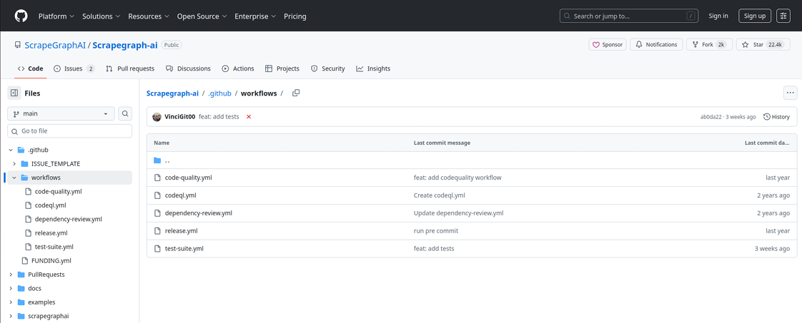
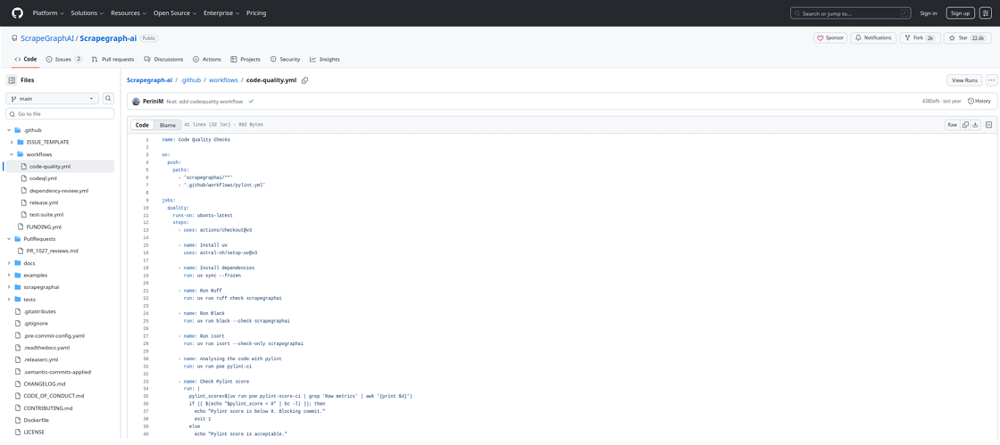
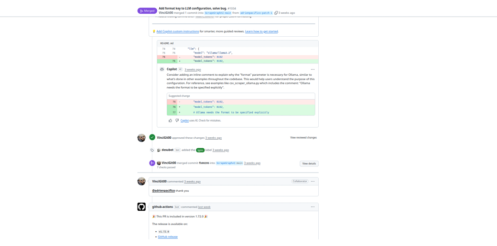

# Atividade 3: Diagnóstico de DevOps e Auditoria de CI/CD

**Disciplina:** Engenharia de Software II (2025.2)  
**Docente:** Prof. Dr. Glauco de Figueiredo Carneiro  
**Projeto Objeto de Estudo:** [Scrapegraph-ai](https://github.com/ScrapeGraphAI/Scrapegraph-ai)
---
**Link do video no Yt:** [Clique aqui!](https://youtu.be/hCBscRM0t1E)
**Link dos Slides usados na apresentação:** [Clique aqui!](https://gamma.app/docs/Atividade-3-Etapa-1-Diagnostico-de-DevOps-e-CICD-jpva3u4a1uz6ush)

---

## 👥 Equipe e Contribuições

| Nome | Matrícula | Contribuição na Atividade |
| :--- | :--- | :--- |
| **Rafael Gomes O. Santos** | 202300095730 | Investigação e Coleta de Evidências (Workflows e PRs) |
| **Cauan Teixeira Machado** | 202300038627 | Introdução ao Projeto e Relevância |
| **Maria Eduarda M. da Silva** | 202300038860 | Análise do Fluxo de Contribuição (`CONTRIBUTING.md`) |
| **José Gabriel R. G. de Almeida** | 202300095599 | Workflow de Qualidade (QA e Testes) |
| **Mateus da Silva Barreto** | 202300038879 | Workflow de Segurança (CodeQL e Dependency Review) |
| **Breno Silva do Nascimento** | 202300038968 | Automação de Release |
| **José Victor Ribeiro de Jesus** | 202300038799 | Ferramentas de Apoio (IA, Bots e Copilot) |
| **Pedro Joaquim Silva Silveira** | 202300038897 | Demonstração Prática e Conclusão |

---

## 🔍 1. Sobre o Projeto
O **Scrapegraph-ai** é uma biblioteca Python de web scraping que utiliza Grandes Modelos de Linguagem (LLMs) e lógica de grafos para criar pipelines de extração de dados flexíveis. Diferente de scrapers tradicionais, ele permite converter páginas HTML complexas em dados estruturados (JSON) de forma inteligente.

---

## 🛠️ 2. Diagnóstico do Cenário Atual (AS-IS)

Nossa auditoria revelou que o projeto possui um nível avançado de maturidade em DevOps, utilizando **GitHub Actions** como plataforma central.

### Principais Automações Identificadas:
1.  **Verificação de Qualidade (Linting):** Uso de ferramentas como `Ruff`, `Black` e `Pylint` para garantir estilo e formatação.
2.  **Testes Automatizados:** Execução de suítes de teste a cada push e pull request.
3.  **Automação de Release:** Uso de Semantic Release para criação automática de versões.

### Evidências da Infraestrutura
A robustez do processo é comprovada pela existência de *Infraestrutura como Código (IaC)* na pasta `.github/workflows/`, conforme evidenciado abaixo:

*(Figura 2: Diretório .github/workflows contendo as definições de CI/CD)*

### Quality Gates Rígidos
O pipeline bloqueia o merge se a pontuação do código cair abaixo de um limite estabelecido. O trecho de código abaixo, extraído do arquivo `code-quality.yml`, mostra a regra que bloqueia commits com score Pylint menor que 8:

*(Figura 4: Trecho do arquivo code-quality.yml definindo as regras de bloqueio)*

---

## 🔄 3. Mapeamento do Fluxo de Trabalho

Com base nos arquivos de configuração, mapeamos o fluxo que todo código percorre desde o desenvolvimento até a aprovação.

**O Fluxo de Qualidade (Quality Gate):**
1.  **Setup:** Checkout do código e instalação do gerenciador de pacotes `uv`.
2.  **Análise Estática:** Execução de `Ruff` (linting), `Black` (formatação) e `Isort` (imports).
3.  **Decisão Automática:** O sistema avalia a nota do `Pylint`.
    * 🔴 **Nota < 8:** O Pull Request é bloqueado (Falha).
    * 🟢 **Nota >= 8:** O Check é aprovado e permite o Merge.

*(Figura 1: Fluxo de CI/CD Mapeado AS-IS)*

---

## 📸 4. Evidências Visuais e Execução

Durante a auditoria, coletamos evidências da execução contínua no repositório oficial. O histórico de Pull Requests mostra que todas as contribuições passam por uma bateria média de 7 verificações antes do merge.

Além disso, bots automatizados gerenciam o lançamento de novas versões (Releases) assim que o código entra na branch principal:

*(Figura 3: Pull Request fechado mostrando "7 checks passed" e a automação de release)*

---

## 📝 Conclusão
O Scrapegraph-ai demonstra uma cultura de DevOps estabelecida, eliminando gargalos manuais e garantindo a integridade do código através de pipelines rigorosos de CI/CD. O desafio da equipe na próxima etapa será replicar este ambiente de qualidade garantindo a mesma segurança e padronização.
